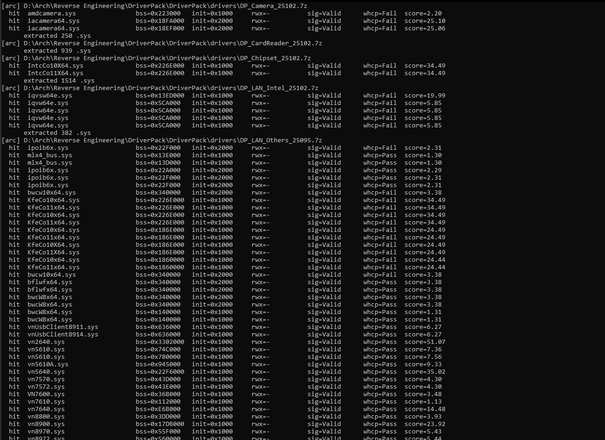

# UpdatedDriverPackScan



PE section scanner for ranking Windows kernel drivers by section layouts
relevant to manual mapping research. Walks a folder tree of `.sys` files,
recurses into nested `.7z` archives without persistent extraction, and
reports three section measurements alongside the Authenticode and WHCP
signing status of each candidate.

| Column      | Description |
|-------------|-------------|
| `.data BSS` | Page-aligned slack at the end of `.data` (vsize beyond raw size, no on-disk bytes). |
| `INIT exec` | Page-aligned size of an executable section named `INIT`. |
| `RWX exec`  | Page-aligned size of a non-`INIT`, non-discardable section flagged `EXECUTE` and `WRITE`. |
| `Sig`       | Authenticode status from `Get-AuthenticodeSignature` (`Valid`, `NotSigned`, etc). |
| `WHCP`      | `signtool /kp` kernel-mode policy result (`Pass`, `Fail`, `?`, `-`). |

Each `.7z` is expanded into a temporary directory for the duration of one
scan pass and removed on completion. Peak disk usage is bounded by the
`.sys` payload of the largest single archive.

## Requirements

- Python 3.8 or later.
- [7-Zip](https://www.7-zip.org/), auto-detected at the default install path
  or anywhere on `PATH`. Required only when scanning `.7z` archives.
- PowerShell, used for `Get-AuthenticodeSignature`.
- Windows SDK `signtool.exe`, auto-detected under
  `Windows Kits\10\bin\*\x64`. Required for the `WHCP` column. The column
  reports `?` when `signtool.exe` cannot be located.

## Usage

```bash
# Folder scan, recurses into .7z without persistent extraction.
python scan.py "D:\path\to\driverpack\drivers"

# Per-file deep inspection with full signature block.
python scan.py "D:\path\to\driver.sys"

# Stream progress on stderr.
python scan.py "D:\drivers" -v

# Write the ranked summary to a file.
python scan.py "D:\drivers" -o results.txt

# Lower the size threshold (default 0xA7000, 668 KB).
python scan.py "D:\drivers" --required 0x40000

# Save the top 10 unique-by-name candidates into ./result/<rank>_<name>.sys.
python scan.py "D:\drivers" --save 10 -o results.txt -v

# Skip the per-hit signtool /kp check for speed. WHCP column reports '-'.
python scan.py "D:\drivers" --no-whcp
```

## Score formula

```
score = (rwx_size  / 64 KB) * 4
      + (init_size / 64 KB)
      + (bss       / 1 MB)
score *= 0.5  if Authenticode status is not "Valid"
```

The score weights section size only. The Authenticode penalty halves the
score for any unsigned, modified, or unverifiable file. WHCP is reported
per row but does not feed back into the score, since the policy result
depends on the verifying machine's Code Integrity configuration.

## Latest results

The most recent full pack scan output is in [`./results.txt`](./results.txt).
The top 10 unique driver files from the same run are saved under
[`./result/`](./result/), named `<rank>_<driver>.sys`.

## Source DriverPack

Results were produced against the offline DriverPack distribution. A torrent
for the same revision is available at
[`./resource/DriverPack-Offline.torrent`](./resource/DriverPack-Offline.torrent).
